# Microsoft Graph Data Connect Data Lake Solution

This walkthrough describes how you can load and copy data from your Office 365 organization (Microsoft Graph) into your Azure storage using Microsoft Graph data connect and then how to extract attributes and ultimately enriched attributes and knowledge. Microsoft Graph data connect traditionally provides Office 365 data to your Azure storage in JSON lines but this walk-though flattens the data and makes it available as entity tables, which are represented as CSVs. In addition to flat CSVs, the solution export data with the Common Data Model structure. Follow Microsoft docementation [here](https://docs.microsoft.com/en-us/common-data-model/) to learn more about the Common Data Model.

In this walkthrough you will:

- Provision required resources in your Azure environment to store and process your Office 365 data
- Use an Azure Data Factory or Synapse to move your Office 365 data through Microsoft Graph data connect into Azure Data Lake Gen2 storage in your environment in JSON lines
- Use Azure Synapse Spark Pool or Databricks to run a PySpark script to convert the Office 365 data from JSON lines into flat CSV or CDM entities

## Pre-requistes
To utilize this walkthrough, you must have Microsoft Graph data connect enabled in your Office 365 organization and have an Azure subscription under the same Azure Active Directory tenant as your Office 365 subscription. Use the steps in [Set up your Microsoft 365 tenant and enable Microsoft Graph Data Connect](https://docs.microsoft.com/en-us/graph/data-connect-quickstart?tabs=Microsoft365) of our Microsoft Graph data connect training module to enable and configure Microsoft Graph data connect in your environment alongside an Azure subscription.

## Provision required resources
To complete the conversion, a few resources must be created/provisioned in your Azure environment, specifically:

- An app registration to enable Microsoft Graph data connect to extract your Office 365 data into your Azure storage. Follow the steps in [Set up your Azure Active Directory app registration](https://docs.microsoft.com/en-us/graph/data-connect-quickstart?tabs=Microsoft365&tutorial-step=2) of our training module to provision the resource. Note down the application ID, tenant ID, and application key as they will be used later in the walkthrough. Ensure the app registration has Storage Blob Data Contributor access to the Azure Data Lake Storage Gen2 account to be created next.
- An Azure Data Lake Storage Gen2 (ADLSg2) account to store the JSON lines outputted from Microsoft Graph data connect. This Storage account can be any new or existing account or the default storage linked to Synapse (if using Synapse pipelines). Follow steps in [Set up your Azure Storage resource](https://docs.microsoft.com/en-us/graph/data-connect-quickstart?tabs=Microsoft365&tutorial-step=3) to setup proper permissions for the storage account. 
  - A file system to store the Office 365 data outputted by Microsoft Graph data connect in JSON format (called json in this walk-though and the default value in the script)
  - A file system to store the outputted CDM entities after the conversion is complete (called cdm in this walk-though and the default value in the script)
  - A file system to store the outputted CSV entities after the conversion is complete (called csv in this walk-though and the default value in the script)
- A prefered orchestration tool (Synapse/Azure Data Factory) and a preferred processing engine (Databricks or Synapse Spark Pool)
- The PySpark script to convert the MGDC JSON lines into CDM and CSV format and to store the resulting files.
  - If using Databricks as your compute engine, have the Databricks notebook in the **src** directory of this repository uploaded into the Databricks instance.
  - If using Synapse, import the Synapse notebook from the **src** directory of this repository into your Synapse workspace (**Develop** -> **Notebooks** -> **import**)
- Synapse have CDM library installed by default. If using Databricks, install the CDM library via Maven.

  
  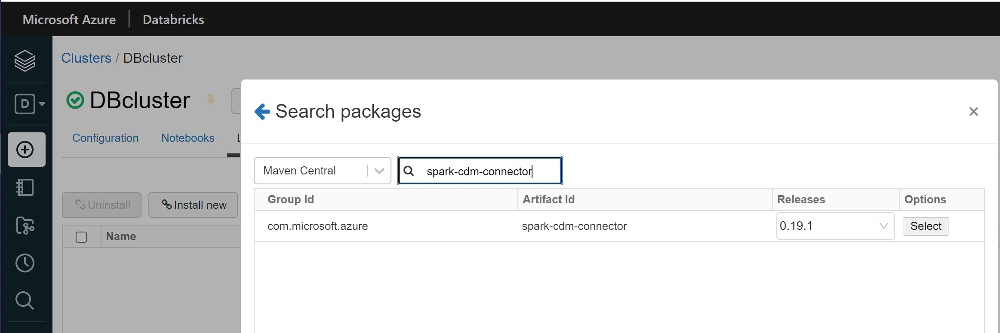

## Load and convert Office 365 data 
Follow the steps here to create a pipeline to export the Office 365 data into an storage account and then transfom into CDM and CSV formats.
- Within the orchestration tool  (Azure Data Factory or Synapse), you'll need to create a few linked service entities using the Azure resources provisioned earlier.
  
  In **ADF/Synapse -> Manage -> Linked Services**:
  - **Create an ADLSg2 linked service**
    - To create the linked service to access the ADLSg2 account, select the **Azure Data Lake Storage Gen2** and create a new linked service. In the resulting blade, ensure you have set the Authentication Method to Service Principal and the Account Selection method as from an Azure subscription. Select the Azure subscription and account created earlier, as well as use the application ID and key noted earlier that has access to the account then click create. 
    
 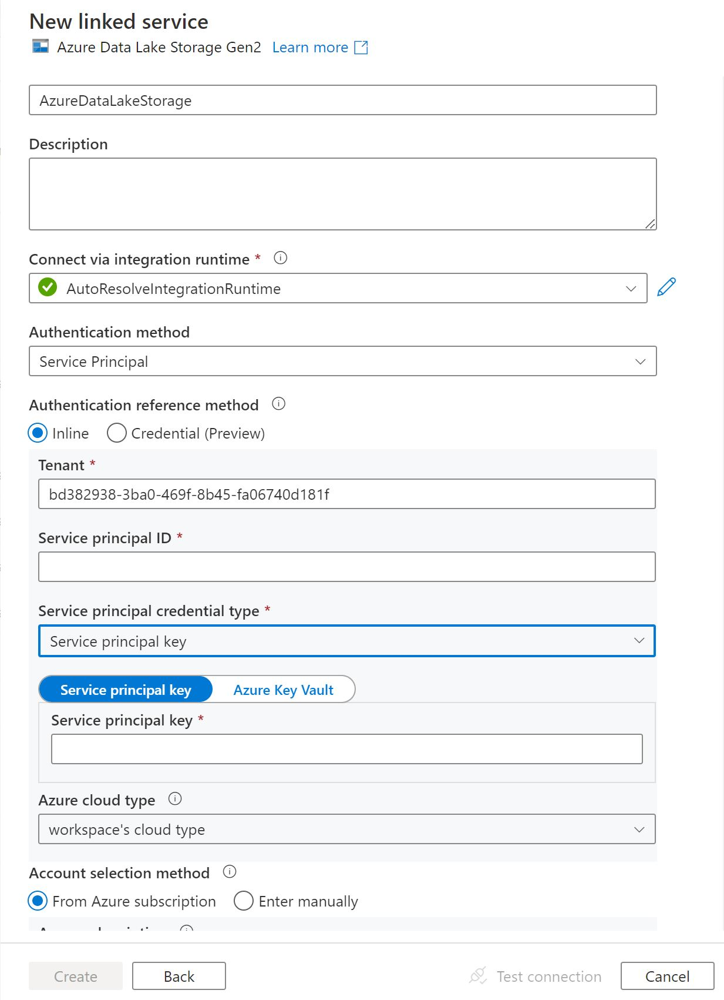 

  - **Create an Office 365 data linked service**
    - To create the linked service to allow Microsoft Graph data connect to move data into your Azure storage account, select **Office 365** and create a new linked service. In the resulting blade, provide the application ID and key noted earlier and select create. This linked service will automatically be used for all of the Office 365 tables. 
    
  

  - **Create a Databricks linked service** (if using Databricks)
    - To create the linked service connected to your Databricks instance, select **Databricks** under compute and create a new linked service. In the resulting blade, ensure appropriate Databricks workspace and cluster is selected. For Access Token, generate it from Azure Databricks workplace. You can find the steps [here](https://docs.databricks.com/dev-tools/api/latest/authentication.html#generate-token).
  
  If using Synapse with Synapse Spark Pool you have to create a new pool.
  - **Create the Synapse Spark Pool** (if using Synapse Spark Pool)
    - In **Synapse -> Manage -> Analytics Pools -> Apache Spark Pool** create a new pool.
- Within the orchestration tool (ADF or Synapse), create a new Pipeline.
- Create the following parameters for the pipeline.
  - **OfficeDataFileSystem** - The file system in the ADLSg2 account to place the Office 365 data in JSON lines. (json for this walkthrough)
  - **DateStartTime** - The start time for what Office 365 you would like to process. The format is 2019-10-22T00:00:00Z
  - **DateEndTime** - The end time for what Office 365 data you would like to process. The format is 2019-10-28T00:00:00Z
  - **StorageAccountName** - The name of the ADLSg2 account
  - **AppID** - The application ID for the app registration provisioned earlier
  - **AppKey** - The application key for the app registration provisioned earlier
  - **TenantId** - The tenant id for the app registration provisioned earlier
  - **CdmDataFileSystem** - The file system in the ADLSg2 account which will contain the CDM entities (cdm for this walkthrough)
  - **CdmModelName** - Sub-directory in the CdmDataFileSystem for the CDM enitities; default to O365-data
  - **MessageDatasetFolder** - Sub-directory in the OfficeDataFileSystem for the messages in JSON; default to message
  - **EventDatasetFolder** - Sub-directory in the OfficeDataFileSystem for events in JSON; default to event
  - **UserDatasetFolder** - Sub-directory in the OfficeDataFileSystem for user data in JSON; default to user
  - **ManagerDatasetFolde**r - Sub-directory in the OfficeDataFileSystem for manager user data in JSON; default to manager
  
 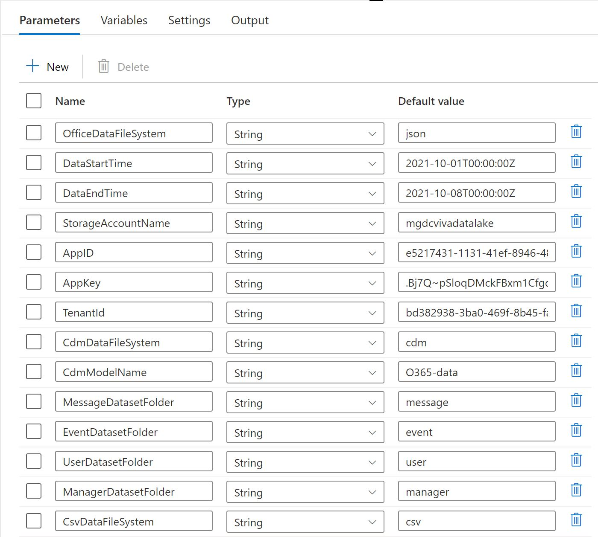 

- Follow steps [here](https://docs.microsoft.com/en-us/graph/data-connect-quickstart?tabs=Microsoft365&tutorial-step=4) to create four **Copy Data** activity to load the following four Office 365 tables with the parameters listed below for each.
  - Event Table (latest version at the moment: BasicDataSet_v0.Event_v1)
    - Source Date filter: input pipeline **DateStartTime** and **DateEndTime** parameters via _Add Dynamic Content_   
 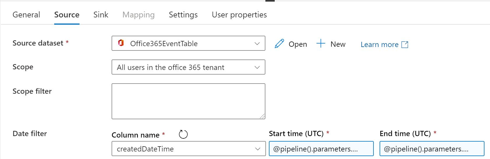 

  - Message Table (latest version at the moment: BasicDataSet_v0.Message_v1)
    - Source Date filter: input pipeline **DateStartTime** and **DateEndTime** parameters via _Add Dynamic Content_ 
 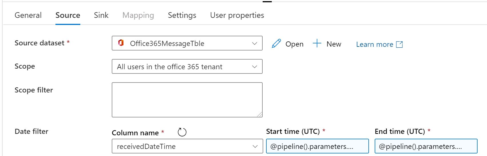 

  - Maneger Table (latest version at the moment: BasicDataSet_v0.Manager_v0)
    - No source Date filter is required
  - User Table(latest version at the moment: BasicDataSet_v0.User_v1)
    - No source Date filter is required
  - Following the instruction, create a new Sink dataset to be used for all four data tables. 
    - Select the storage account provisioned in this walk-through, add **OfficeDataFileSystem**, **DatasetPath**, **PipelineID** as the sink dataset parameters and add **@concat(dataset().OfficeDataFileSystem,'/',dataset().PipelineID,'/',dataset().DatasetPath)** as File Path in **Directory** field 
  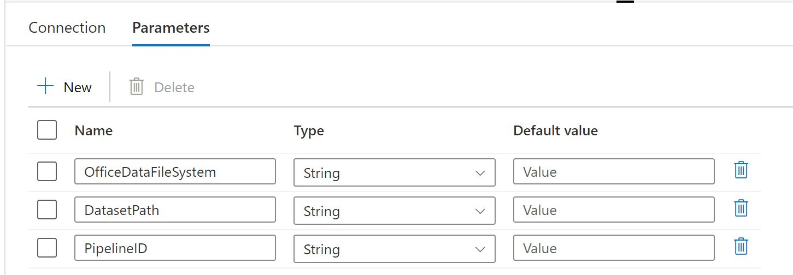 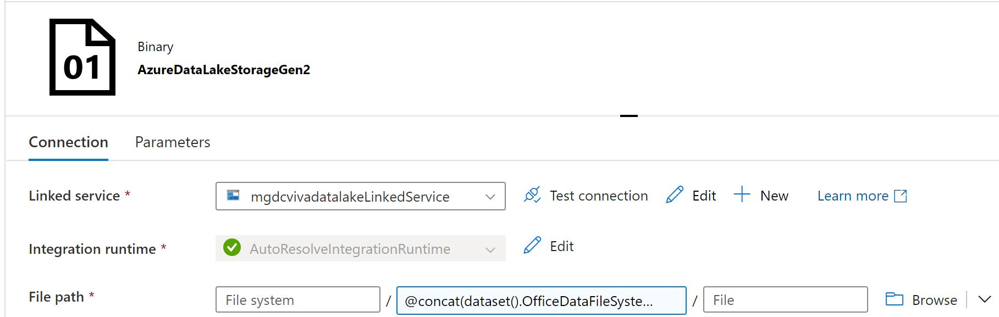

    - Initialize the Sink parameters with the followings for each of the four **Copy Data Sink**
      - **OfficeDataFileSystem**:@pipeline().parameters.OfficeDataFileSystem
      - **DatasetPath**: one of @pipeline().parameters.EventDatasetFolder, @pipeline().parameters.MessageDatasetFolder, @pipeline().parameters.ManagerDatasetFolder, @pipeline().parameters.UserDatasetFolder values accordingly
      - **PipelineID**: @pipeline().RunId 
 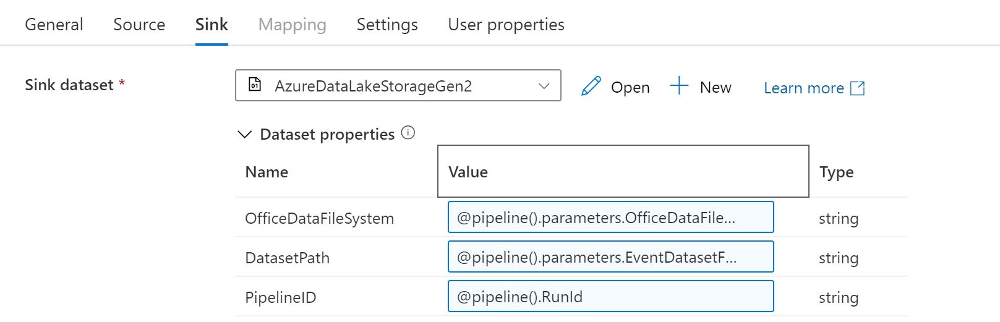 

- Based on your orchestration tool and preferred processing platform, add a Synapse Nottbook or Databricks Notbook to the pipeline. In the settings:
  - Link to the imported notebook downloaded and imported to the tool in this walk-through
  - Select the Spark Pool or the Databricks linked service
  - Base Parameters as 
 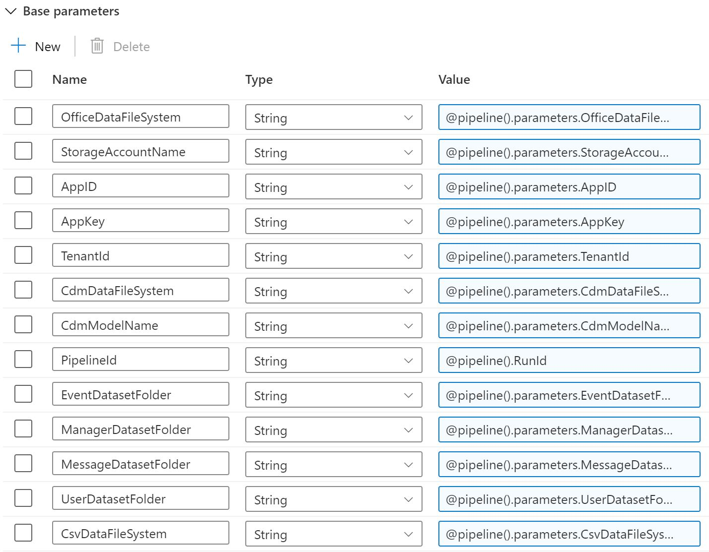 

- At this point, the pipeline should look like this 
 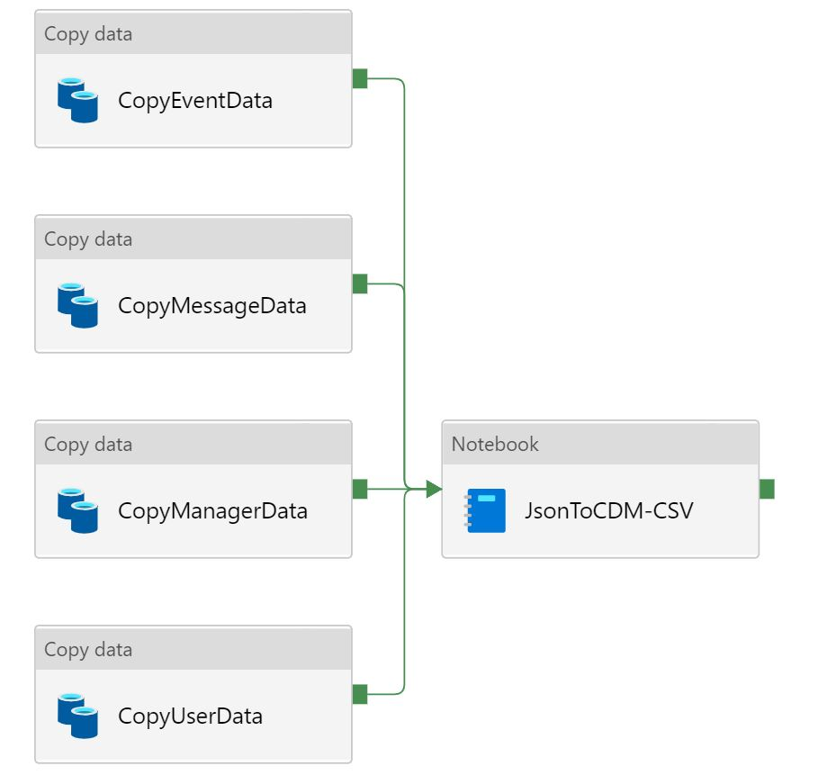 

- Publish the pipeline.
- For the first trigger, follow steps [here](https://docs.microsoft.com/en-us/graph/data-connect-quickstart?tabs=Microsoft365&tutorial-step=5) to monitor and approve data consent requests at Microsoft 365 Admin Center or via Powershell. 
  - **Note**: Each approved request is valid for 6 months unless there is a change in the pipeline (e.g. name change of a copy data activity or pipeline name)

This is the exported dataset schema through this pipeline.

 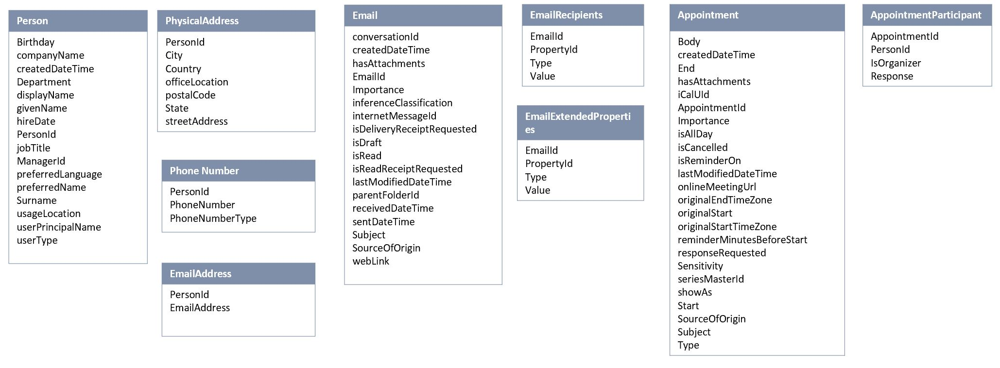 

**Note**: All the parameters used in the pipeline are used to have a configurable pipeline. To skip all the parameter configuration details, you can use static paths and values.
