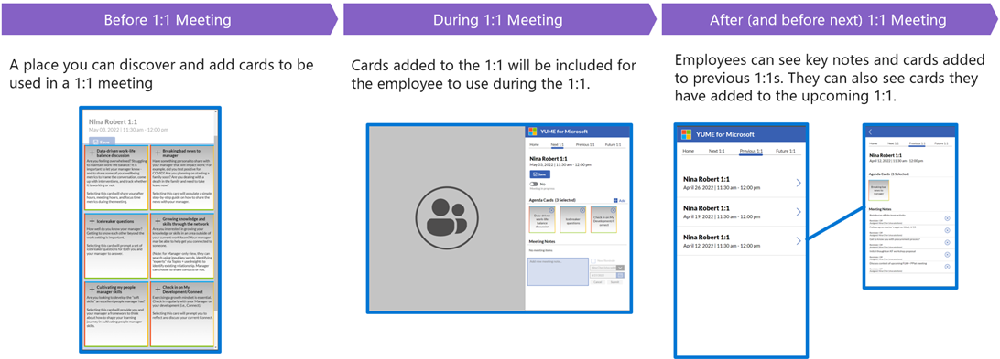

# YUME enables meaningful manager-employee relationships through better 1:1 engagement

## Summary
YUME is a Viva tool that enhances both the manager and employee experience
Equips managers and employees with topics and guided conversations for deeper 1:1 discussion and connection
Leverages M365 add-in functionality with cards, nudges and notifications

## Why use this and what value does it provide
- In a workplace study, 92% of employees consider meetings costly and unproductive. 
- YUME empowers the manager and employee driving employee engagement and retention
- Common use cases:
    - Difficult Conversations; provides a toolkit for employees to engage with managers in difficult discussions
    - Employee Engagement & Retention

## Full Deployment details

- [Deploy solution](https://docs.microsoft.com/en-us/viva/solutions/Yume) 

## Disclaimer

**THIS CODE IS PROVIDED *AS IS* WITHOUT WARRANTY OF ANY KIND, EITHER EXPRESS OR IMPLIED, INCLUDING ANY IMPLIED WARRANTIES OF FITNESS FOR A PARTICULAR PURPOSE, MERCHANTABILITY, OR NON-INFRINGEMENT.**
